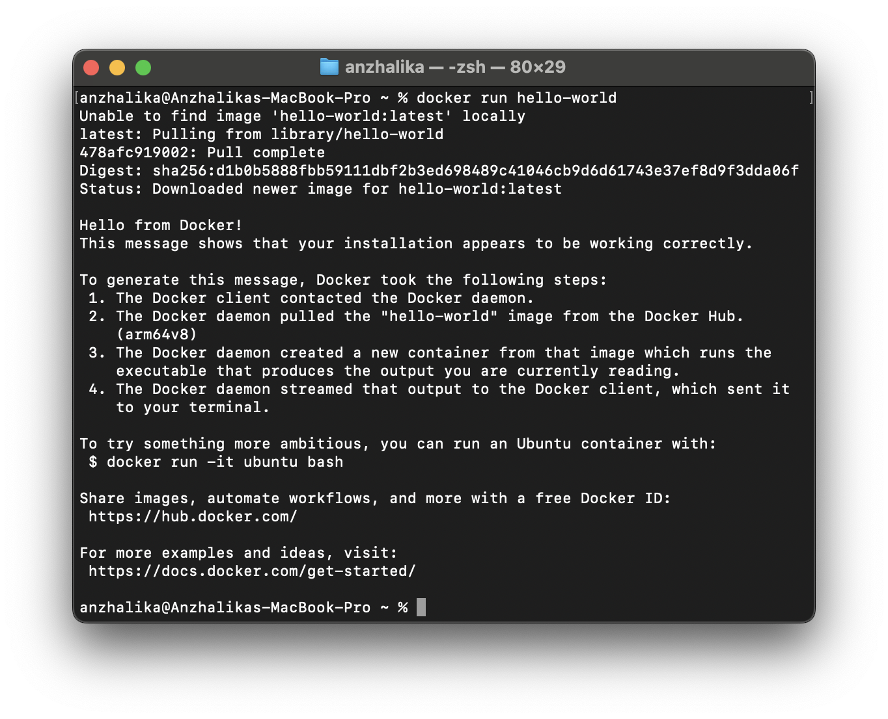
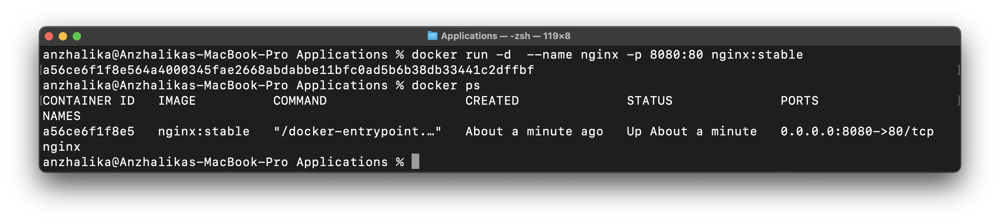
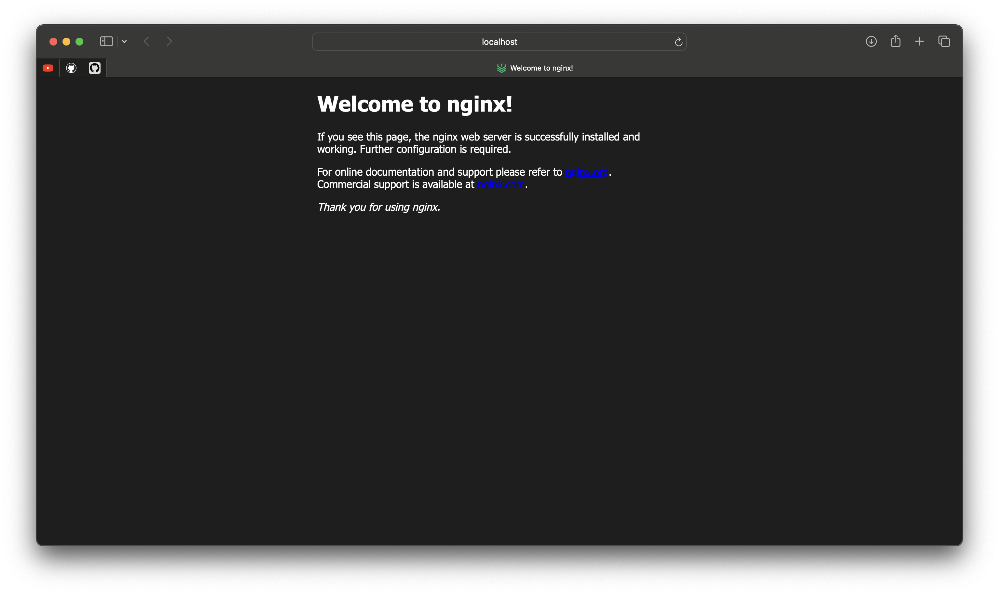
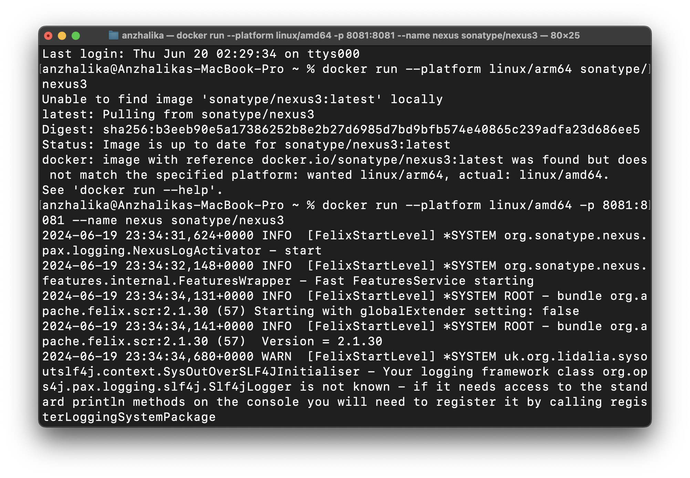
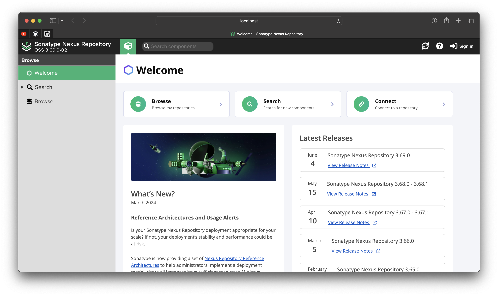
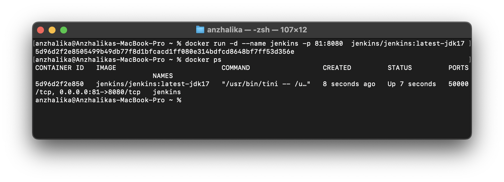
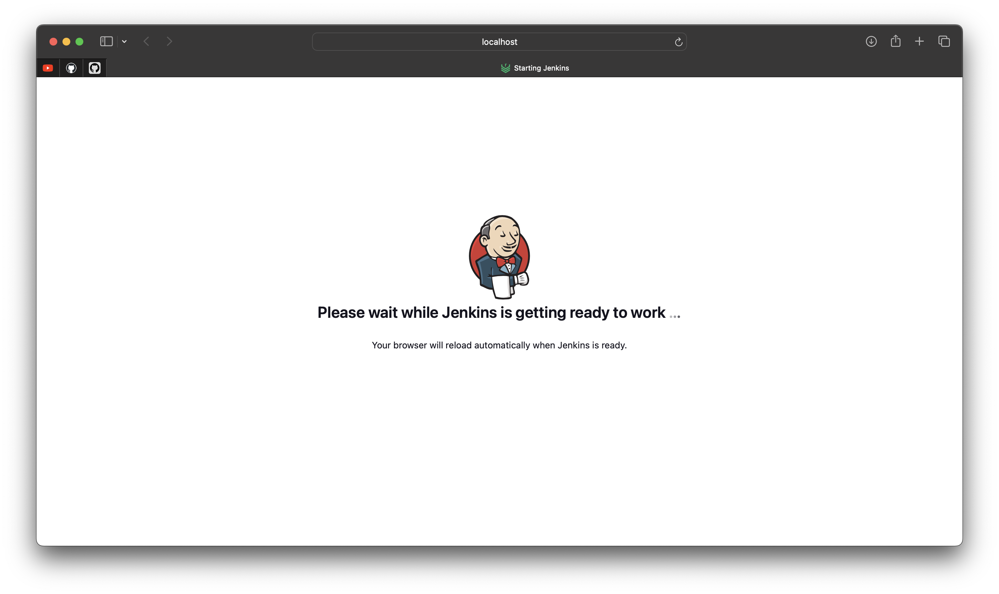

Установить Docker на хостовую ОС. В случае с Windows использовать WSL backend.
-

- Установить Docker Desktop для Mac Apple silicon
- Установить rosetta (прослойка для эмулящии х86):

```bash
softwareupdate --install-rosetta 
``` 

Убедиться, что Docker работает исправно путем запуска контейнера hello-world.
-



Установить Nginx используя Docker образ
-
``` bash
docker run -d --name nginx -p 8080:80 nginx:stable
``` 

>run -запуск контейнера  

>-d -запуск контейнера в фоновом режиме

>-р 8080:80 -проброс портов между контейнером и хостом  

>nginx:stable -использование стабильной версии nginx




Изучить следующие команды и их флаги:
-

- docker run (-i, -t, -d, --rm)
- docker ps (-a, -l, -q)
- docker images
- docker start/docker stop/docker restart
- docker exec

>docker run -создание контейнерa из заданного обзаза и запускает его(при отсутствии образа в системе-загрузка образа  
-i -возможность взаимодействия с терминалом внутри контейнера  
-t —доступ к терминалу внутри контейнера  
-d -запуск контейнера в фоновом режиме  
--rm -автоматическое удаление контейнера после завершения его работы

>docker ps -вывод списка контейнеров  
-a -показaть все контейнеры (без флага ps выведет только работающие контейнеры)  
-l  -посмотреть последний созданный контейнер  
-q - просмотреть только ID контейнеров

>docker images -вывести список образов

>docker start -старт остановленного ранее контейнера  
docker stop -завершить работу конкретного контейнера  
docker restart -перезапуск контейнера

>-docker exec -интерактивно подключиться к контейнеру для управления


Установить Nexus используя Docker образ
-

``` bash
docker run --platform linux/arm64 sonatype/nexus3
``` 



 Установить Jenkins используя Docker образ
 -
``` bash
docker run -d --name jenkins -p 81:8080 jenkins/jenkins:latest-jdk17
``` 


