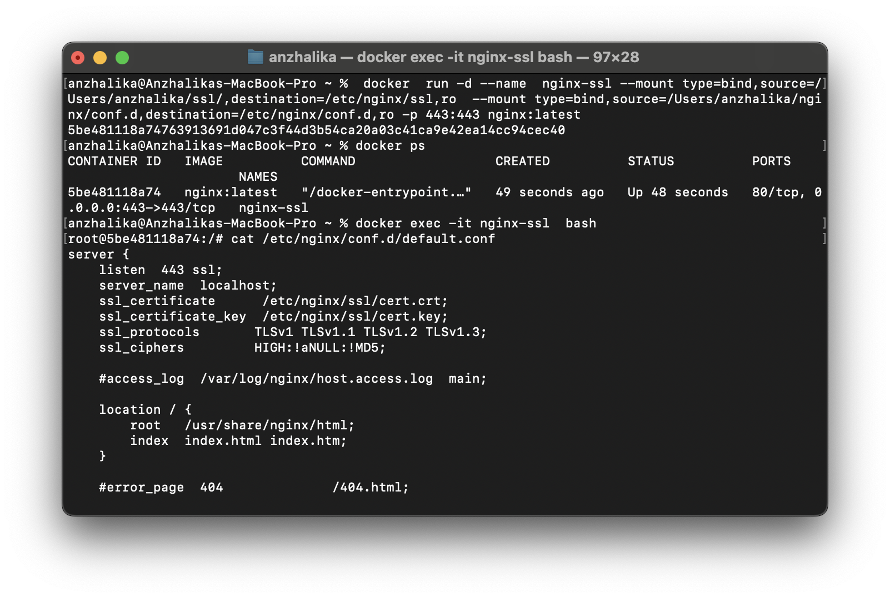
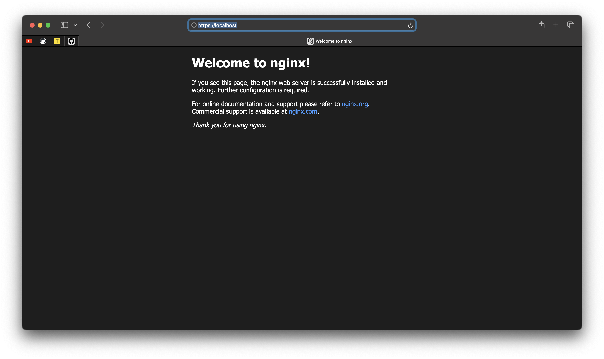
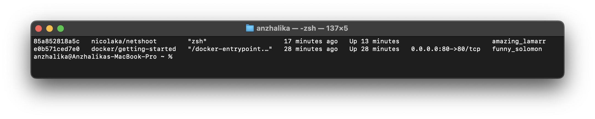
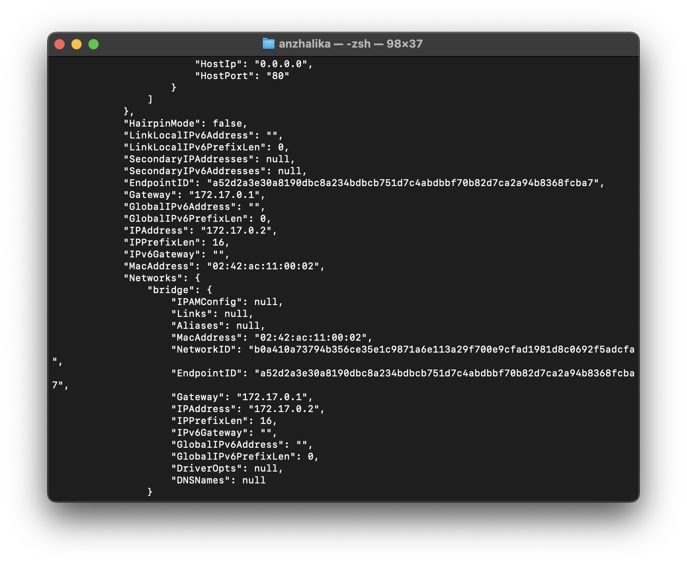
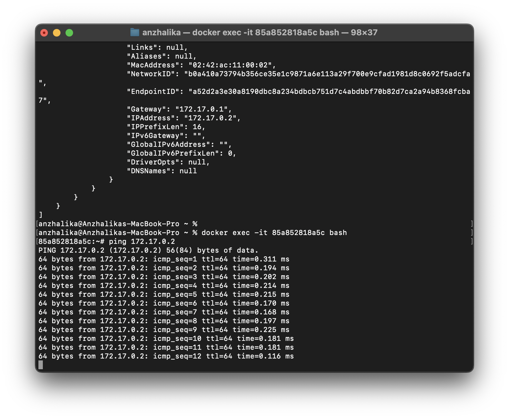
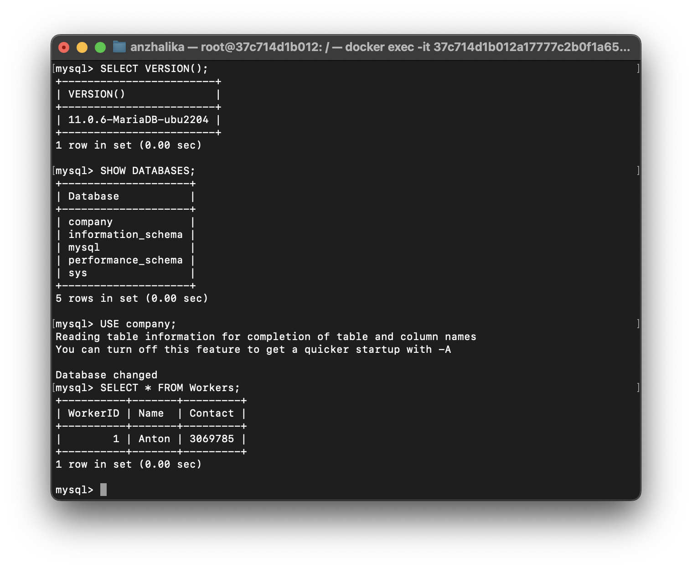
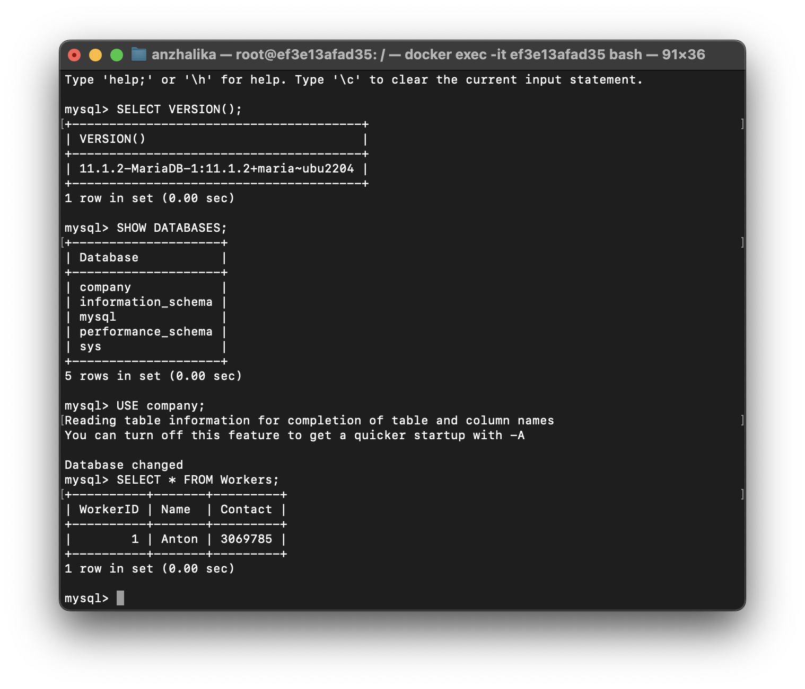

Установить Nginx и смонтировать в него:
-

- конфигурационный файл с хоста, который выполняет настройку HTTPS для страницы по умолчанию
- директорию с сертификатами

``` bash
docker  run -d --name  nginx-ssl --mount type=bind,source=/Users/anzhalika/ssl/,destination=/etc/nginx/ssl,ro  --mount type=bind,source=/Users/anzhalika/nginx/conf.d,destination=/etc/nginx/conf.d,ro -p 443:443 nginx:latest 
```



Запустить 2 Docker контейнера (например, Docker Getting Started и netshoot) с настройками сети по умолчанию и проверить есть ли между ними соединение.
-



Выполнение docker inspect для двух контейнеров:




Зайти на один из контейнеров и выполнить ping другого:

``` bash
docker exec -it id bash
``` 



Создать именованный Docker volume, который будет использоваться для хранения данных MariaDB. Установить MariaDB версии 11.0 используя ранее созданный volume.
Затем:
-

- Запустить интерактивную сессию Bash в запущенном контейнере при помощи docker exec
- Проверить версию MariaDB через SQL запрос.
- Создать БД, таблицу и запись.
- Выполнить апгрейд MariaDB путем подмены версии используемого Docker образа на 11.1.2.
- Проверить, что версия MariaDB поменялась.
- Проверить, что данные остались.


Создание volume и установка MariaDB:
``` bash
docker volume create --name mariadb

docker run -d -v mariadb:/var/lib/mysql --env MARIADB_ROOT_PASSWORD=password mariadb:11.0
```
Запуск bash сессии:

``` bash
docker exec -it id bash
``` 
Проверка версии MariaDB:

``` bash
apt-get update 

apt-get install mysql-client -y

mysql -u root -p

> SELECT VERSION();
```

Создание БД,таблицы и записи:
``` bash
>CREATE DATABASE company;

>SHOW DATABASES; 

>USE company;

>CREATE TABLE IF NOT EXISTS  Workers (
    ->   WorkerID INT NOT NULL , 
    ->   Name VARCHAR(100) NOT NULL, 
    ->   Contact INT NOT NULL );

> INSERT INTO Workers (WorkerID,Name,Contact) VALUES (1,"Anton",3069785);

> SELECT * FROM Workers;
``` 


Удаление предыдущей версии MariaDB и запуск новой:

``` bash
docker stop id

docker rm id

docker run -d -v mariadb:/var/lib/mysql --env MARIADB_ROOT_PASSWORD=password mariadb:11.1.2
```
