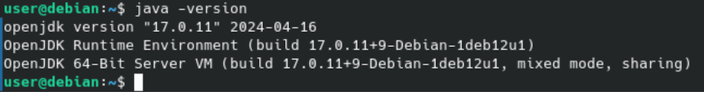
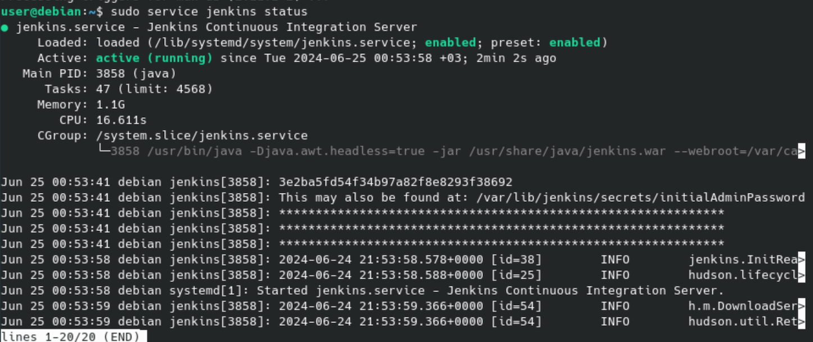
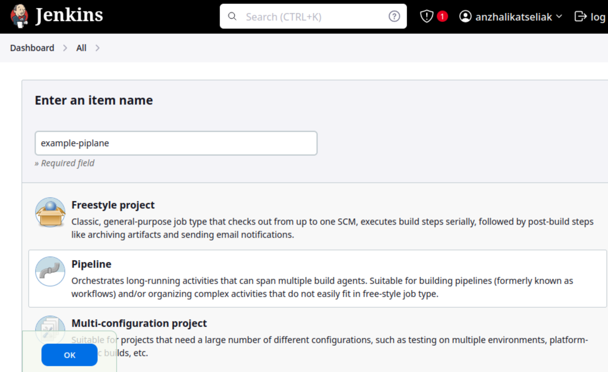
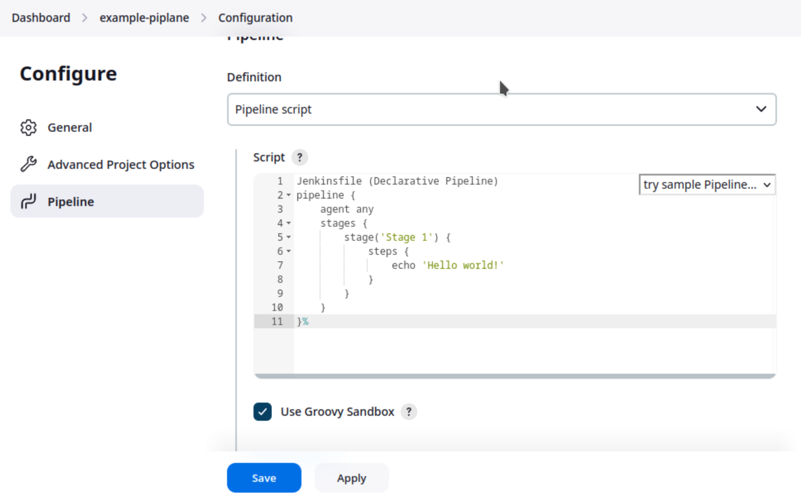
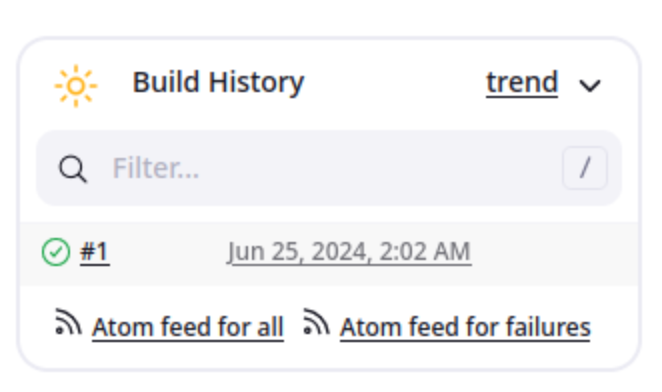
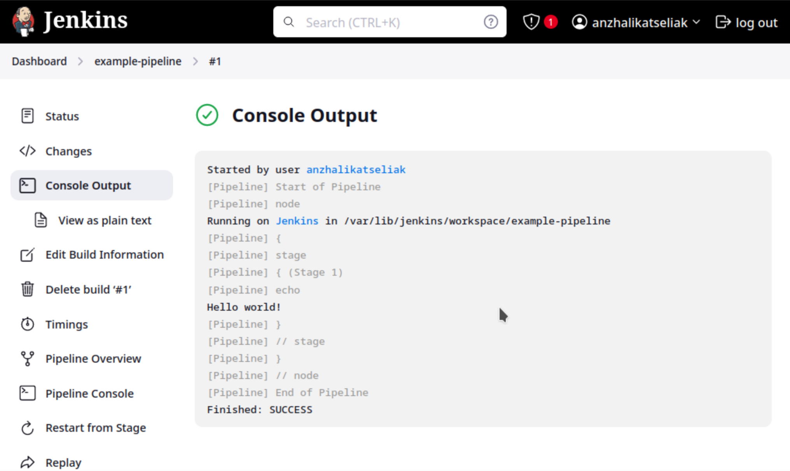
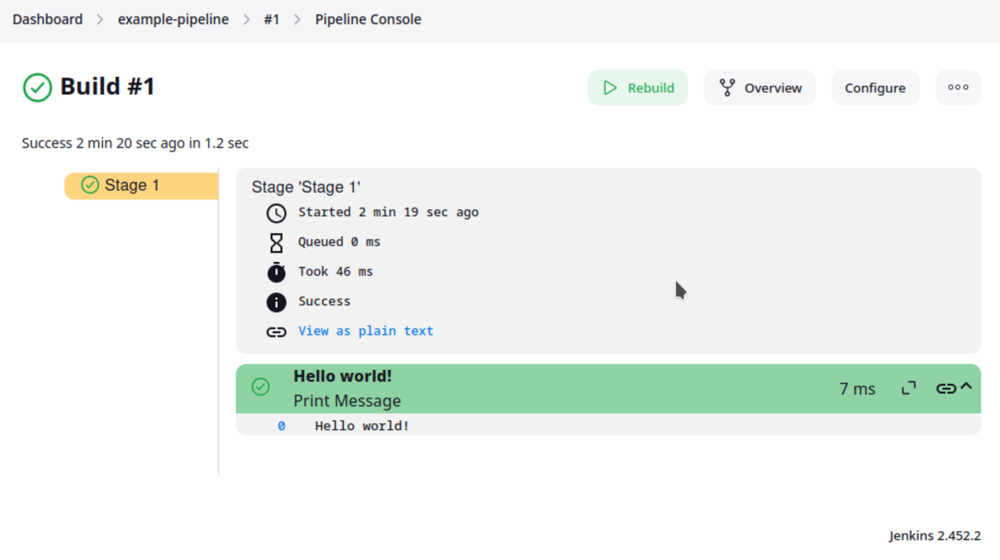

Прочитать статью.
-
✓

Установить Jenkins.
-
Установка openjdk:

``` bash
sudo apt-get install openjdk-17-jre
``` 


Установка Jenkins LTS:

``` bash
sudo wget -O /usr/share/keyrings/jenkins-keyring.asc \
  https://pkg.jenkins.io/debian-stable/jenkins.io-2023.key
echo "deb [signed-by=/usr/share/keyrings/jenkins-keyring.asc]" \
  https://pkg.jenkins.io/debian-stable binary/ | sudo tee \
  /etc/apt/sources.list.d/jenkins.list > /dev/null
sudo apt-get update
sudo apt-get install jenkins
``` 
Проверка:

``` bash
sudo service jenkins status
``` 


Создать свой первый pipeline по инструкции "Through the classic UI"
-

Создание:
- New item
- Enter an item name 
- Pipeline
- Ok



- Pipeline
- Definition
- Pipeline script

``` bash
pipeline {
    agent any 
    stages {
        stage('Stage 1') {
            steps {
                echo 'Hello world!' 
            }
        }
    }
}
``` 



- Save
- Build Now



