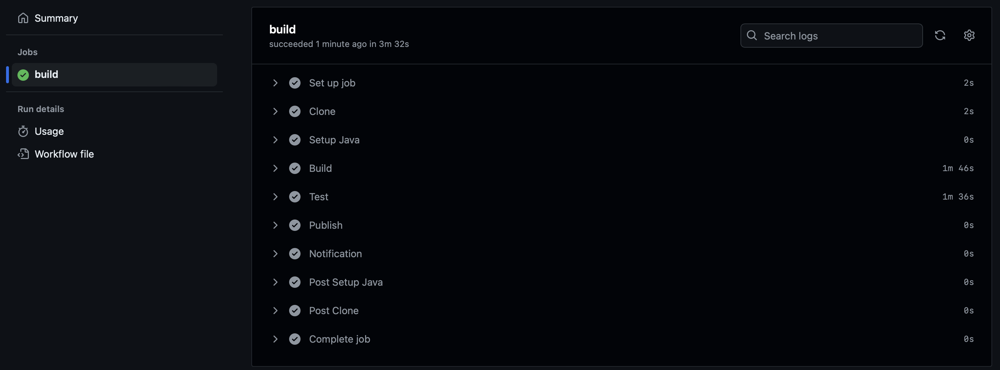
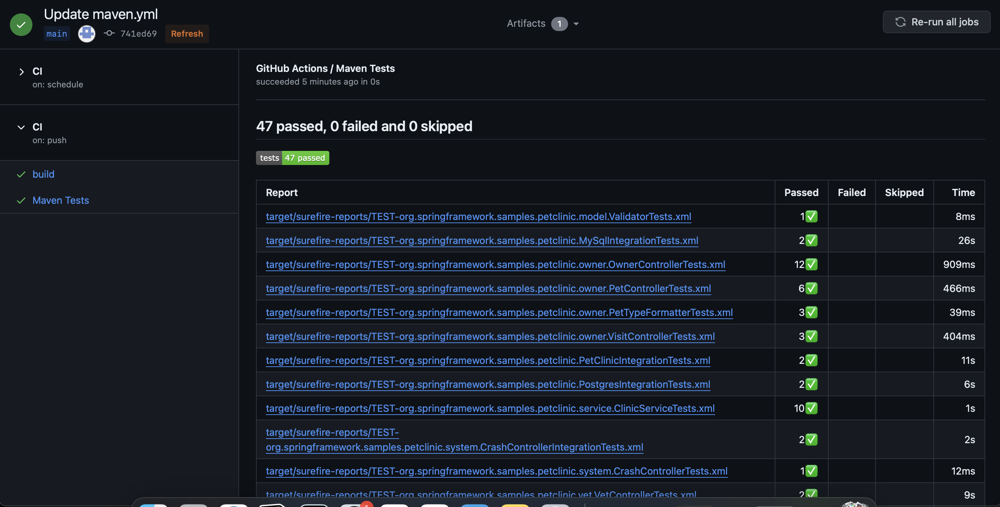
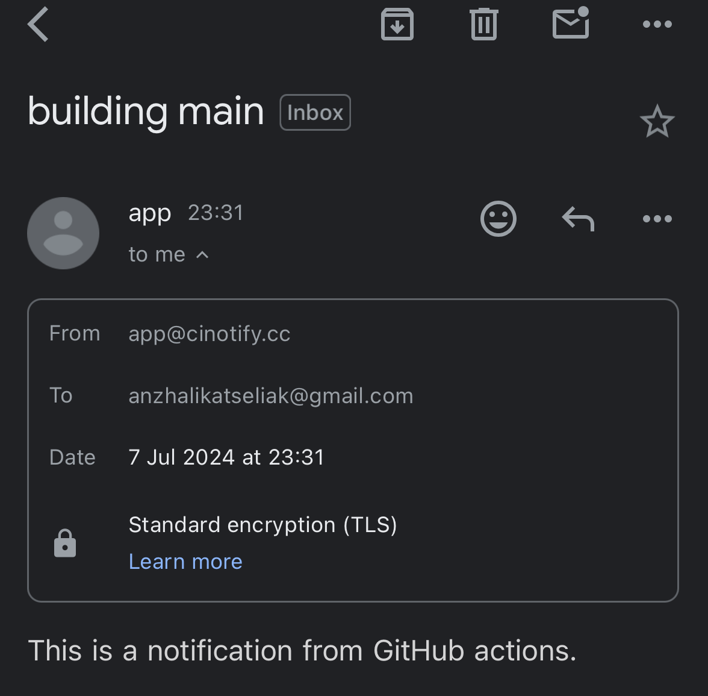
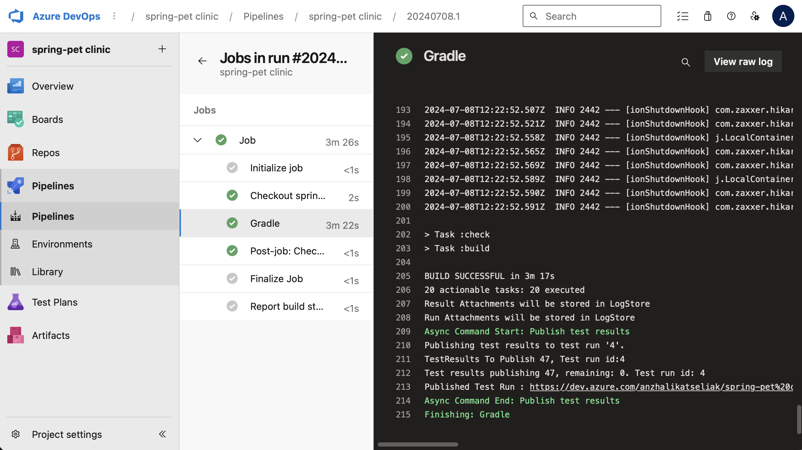
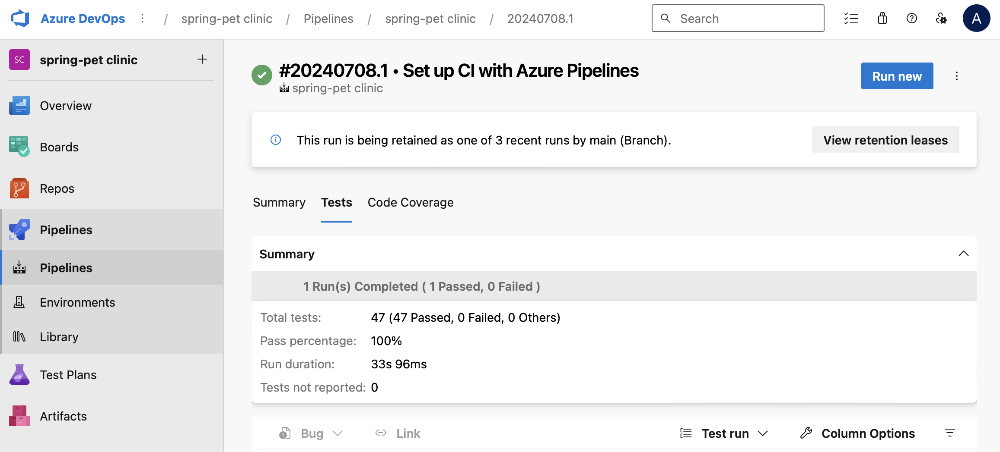
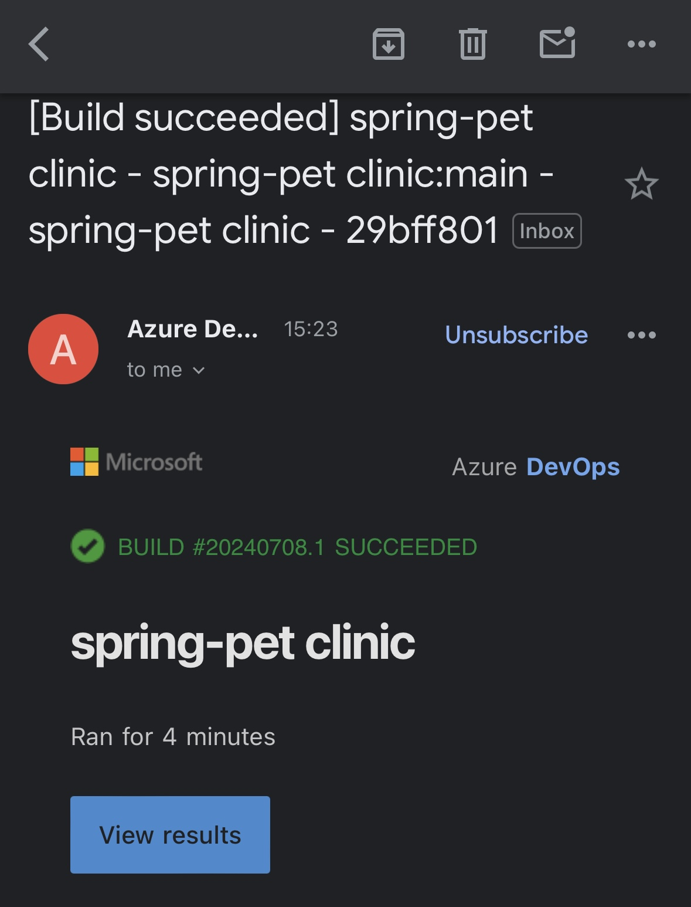

 Зарегестрироваться на любой облачной CI платформе (например BitBucket, GitLab, GitHub).Реализовать pipeline для проекта spring-petclinic, который состоит из следующих этапов (stages):
-
- Clone
- Клонируется данный проект. Обратите внимание, что этот репозиторий приватный и для того, чтобы его склонировать нужно использовать какие-то credentials.
- Build
- Происходит сборка проекта через Maven или Gradle и запускаются юнит-тесты.
- Publish
- Публикуется отчёт тестирования.
- Notification
- Отправляется письмо с результатом сборки, тому кто её запустил.


 
 Github Actions (Maven):
 -
 

- Создать репозиторий и перейти в Actions:

>Actions -> Choose a workflow -> Simple workflow -> Configure -> Commit changes

- Добавить SSH секрет в настройках репозитория:

>Settings -> Secrets and variables -> Actions -> New repository sectet -> Add secret


- В случае ошибки 'Error: HttpError: Resource not accessible by integration' добавить необходимые права перейдя в Settings репозитория и сделать Re-run:

>Settings -> Actions -> General -> Workflows permissions -> Read and write permissions

[maven.yml ](/HW29/maven.yml) 

Результат выполнения:


Тесты:


Уведомление:



Azure DevOps Pipelines (Gradle):
-
- Создать организацию (anzhalikatseliak)

- Создать проект
>Create a project to get started -> spring-petclinic -> Private -> Create Project

- Создать PAT token Github
>Github -> Settings -> Developer Settings -> Personal access tokens -> Tokens(classic) -> Generate new token(classic)

>New personal access token (classic): Note Azure Devops -> 7days -> repo -> Generate token

- Импортировать репозиторий из Github

>Repos ->  Import a repository -> Import a Git repository:
Repository type -> Git  
Clone URL * -> https://github.com/tms-dos21-onl/spring-petclinic
Username -> anzhalikatseliak  
Password / PAT * -> добавить созданный ранее токен

- Поменять default branch (если она не соответсвует предущему репозиторию)

>Repos -> Branches:  
main -> more options -> Set as default branch

- Создать пайплайн

>Pipelines -> Create Pipeline -> Azure Repos Git -> Select a repository -> spring-pet-clinic

>Configure your pipeline -> Gradle

Редактирование пайплайна:

Изменить jdkVersionOption:'1.17' -> Save and run 

>Ошибки:
>
>1)если агенты от Microsoft еще не получены - будет ошибка   
>2)отсутствие java на созданном вручную агенте 


- Создание агента вручную

>Есть два варианта - получить  бесплатные минуты от Microsoft (Hosted agents),но ожидание может занять много времени или создать собственный агент с помощью docker 

Добавление в Agent Pools

>Project settings -> Agent pools -> Add agent pool -> Pool type: Self-hosted -> Name: docker -> Pipeline permissions: Grand access permission to all pipelines

Создание docker агента локально следуя примеру из [документации](https://learn.microsoft.com/en-us/azure/devops/pipelines/agents/docker?view=azure-devops#linux)


Создание директории и создание dockerfile:

```bash
mkdir azp-agent-in-docker

cd ~/azp-agent-in-docker/   

vim ~/azp-agent-in-docker/azp-agent-linux.dockerfile
```

[azp-agent-linux.dockerfile](/HW29/azp-agent-linux.dockerfile) 

Для избежания ошибки с java в пайплайне необходимо добавить в образ openjdk-17-jdk и при запуске контиейнера добавить переменную:  
'-e JAVA_HOME_17_X64="/usr/lib/jvm/java-17-openjdk-amd64'

Создание образа:
```bash
docker build --platform linux/amd64 --tag "azp-agent:linux" --file "./azp-agent-linux.dockerfile" .
```

Запуск контейнера:
```bash
docker run --platform linux/amd64 -e AZP_URL="https://dev.azure.com/anzhalikatseliak" -e AZP_TOKEN=<SECRET> -e AZP_POOL="docker" -e AZP_AGENT_NAME="Docker Agent - Linux" -e JAVA_HOME_17_X64="/usr/lib/jvm/java-17-openjdk-amd64"  --name "azp-agent-linux" azp-agent:linux
```


Результат:

Тесты:

Получение автоматического уведомления:

