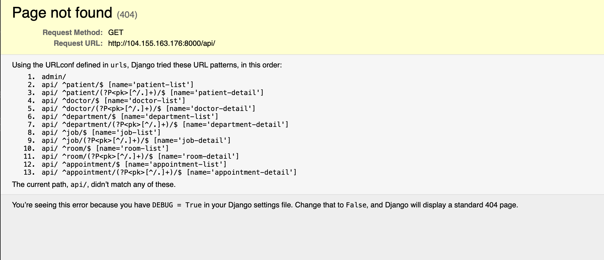
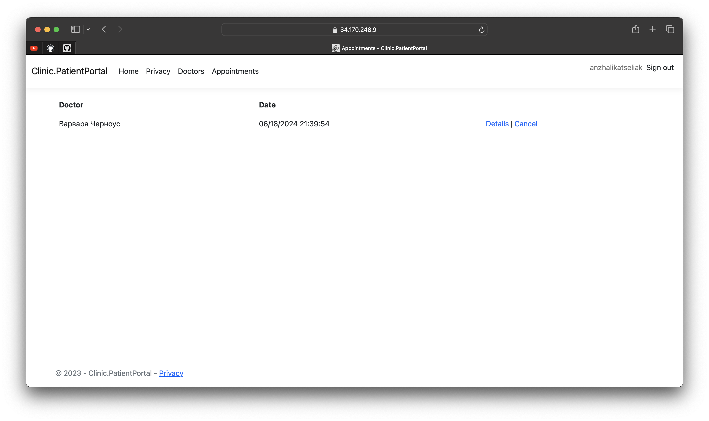

Установить приложение Clinic v1 в Google Cloud Platform согласно инструкции. Для хостинга БД использовать Google Cloud SQL с поддержкой соединений только во внутренней сети (иными словами, БД будет доступна только по внутреннему/приватному IP). Сами сервисы установить на виртуальные машины Google Compute Engine (GCE) с ОС Debian 12. Проверить работоспособность приложения путём создания записи на приём к любому врачу.
-


- Скачать Clinic.PatientPortal.1.1.3.tar.gz и Clinic.Portal.1.1.3.tar.gz

- Создать vm instance clinic-portal и clinic-patient-portal c добавлением ssh ключа локальной машины

- Создать базу mysql, оставив  одну галочку “private ip”


CLINIC-PORTAL:

* Ssh copy:

``` bash
scp Clinic.Portal.1.1.3.tar.gz anzhalika@ip:/home/anzhalika
``` 

* Разархивирование:

``` bash
tar -xf Clinic.Portal.1.1.3.tar 
``` 

* Установка зависимостей:

``` bash
sudo apt update && sudo apt upgrade -y

sudo apt install -y build-essential default-libmysqlclient-dev pkg-config python3.11-dev python3.11-venv default-mysql-client
``` 
* MySql:

Изменение пути в clinic-portal.sql:

```
SOURCE /home/anzhalika/.initdb.d/clinic-portal/dump.sql;
``` 

``` bash
mysql -h  ip -u root -p

SET NAMES utf8  #для избежания проблем с кодировкой 

source clinic-portal.sql;
``` 

* Редактирование файла settings.py:

``` bash
#ALLOWED_HOSTS = os.environ.get('ALLOWED_HOSTS').split()
ALLOWED_HOSTS = "['*']"
``` 

* Создание виртуального окружения:

``` bash
python3 -m venv .venv
``` 
* Активация:

``` bash
. .venv/bin/activate
``` 

* Установка python пакетов:

``` bash
pip3 install -r requirements.txt
``` 

* Изменение файла .env

``` bash
ALLOWED_HOSTS=[‘*’]
DB_HOST=ip
``` 

* Проверка:

``` bash
python3 manage.py runserver 0.0.0.0:8000
``` 



CLINIC-PATIENT-PORTAL:

* ssh copy:

``` bash
scp Clinic.PatientPortal.1.1.3.tar anzhalika@ip:/home/anzhalika
``` 

* Разархивирование:

``` bash
tar -xf Clinic.PatientPortal.1.1.3. tar
``` 

* Установка .NET Runtime 6:

``` bash
wget https://packages.microsoft.com/config/debian/12/packages-microsoft-prod.deb -O packages-microsoft-prod.deb

sudo dpkg -i packages-microsoft-prod.deb

rm packages-microsoft-prod.deb

sudo apt update && sudo apt install -y aspnetcore-runtime-6.0 dotnet-runtime-6.0
``` 
* Github:  

>Settings  
Developer Settings  
OAuth Apps   
New OAuth App

>Установить поля Name и Email в своем GitHub profile

* MySql:

``` bash
sudo apt-get install default-mysql-client -y

mysql -h  ip -u root -p
 
source patient-portal.sql;
``` 

* Создание сертификатов:
``` bash
openssl genrsa 2048 > cert.key

chmod 400 cert.key

openssl req -new -x509 -nodes -sha256 -days 365 -key cert.key -out cert.crt
``` 

* Редактирование appsettings.json:

``` bash
"DefaultConnection": "server=ip;database=clinic;user=patient;password 

"Uri": "http://ip:8000/"
"GitHub": {
"ClientId": "подставить ID "
"ClientSecret": "подставить секрет”,
"EnterpriseDomain" оставить пустым
``` 

* Открытие порта 8443:

>VPC network   
firewall  
create new firewall rule 

* Проверка:

dotnet Clinic.PatientPortal.dll --urls https://0.0.0.0:8443


Запись к врачу:  




