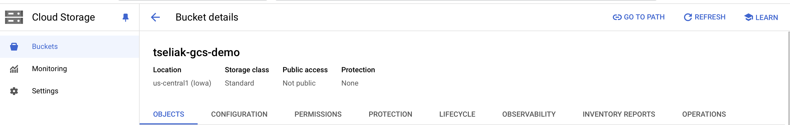
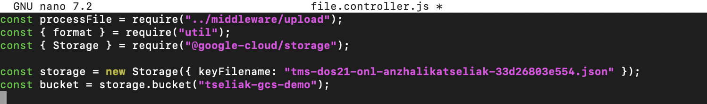

1)Работа с Google Cloud Storage (GCS):
-
- Создать GCE, открыть SSH сессию в созданную VM.

- Cклонировать репозиторий и ознакомиться с проектом и инструкцией к нему.

- Создать необходимые ресурсы для работы приложения:
- Создать GCS Bucket <LASTNAME>-gcs-demo.
>Cloud Storage   
>Create a bucket

- Создать Service Account <LASTNAME>-gcs-demo и назначьте ему роль Storage Object Admin (IAM & Admin -> IAM -> GRANT ACCESS)

- Сгенерировать и скачать Service Account Key в формате JSON.

- Установить Node.js 18.

```bash
sudo apt-get install -y curl

curl -fsSL https://deb.nodesource.com/setup_18.x -o nodesource_setup.sh

sudo -E bash nodesource_setup.sh

sudo apt-get install -y nodejs
```
- Установить зависимости приложения через NPM.
```bash
npm install
```
- Поправить имя GCS Bucket и имя файла с Service Account Key в каком-то из .js файлов приложения.

Копирование сохраненного ранее ключа:
```bash
 scp tms-dos21-onl-anzhalikatseliak-33d26803e554.json anzhalika@35.188.219.66:/home/anzhalika/google-cloud-storage-nodejs-upload-file
```
Изменение файла:


- Запустить приложение и проверить его работоспособность путем выполнение нескольких HTTP запросов через Postman как описано в Node.js upload File to Google Cloud Storage example параграфе

```bash
node server.js
```
>POST > Body > from-data > file > file


2)Настройка автомасштабирования:
-
- Создать шаблон виртуальной машины apache-php-template:
- Активировать Allow HTTP traffic.
- В качестве startup скрипта написать команды для установки Apache веб-сервера с поддержкой PHP и создания phpinfo страницы 
php phpinfo.

  
  
    
```bash
sudo apt-get install -y ca-certificates apt-transport-https software-properties-common 
echo "deb https://packages.sury.org/php/ $(lsb_release -sc) main" | sudo tee /etc/apt/sources.list.d/sury-php.list
wget -qO  - https://packages.sury.org/php/apt.gpg | sudo apt-key add -

sudo apt-get update
sudo apt-get install -y apache2 php8.1 libapache2-mod-php

echo "<?php phpinfo(); ?>" | sudo tee /var/www/html/index.php
```
Создание vm из темплейта и проверка:


- Создать группу виртуальных машин apache-php-group с помощью шаблона apache-php-template:
- Использовать мультизональную локацию.
- Настроить автомасштабирование от 2 до 4 экземпляров.
- Понизить порог для автомасштабирования до 30% CPU.


Проверка:

- Создать Application Load Balancer:
- В качестве Backend использовать ранее созданную группу VM apache-php-group:
- Выключить Cloud CDN.
- В качестве, Health Check использовать просто проверку доступности домашней страницы Apache.
- Проверить распределение трафика путем выполнения HTTP запроса GET /index.php через Load Balancer и сравнения свойства SERVER_ADDR в phpinfo таблице.
- Сгенерировать нагрузку на Load Balancer и убедиться, что работает автомасштабирование.


Проверка:


