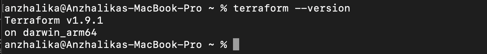
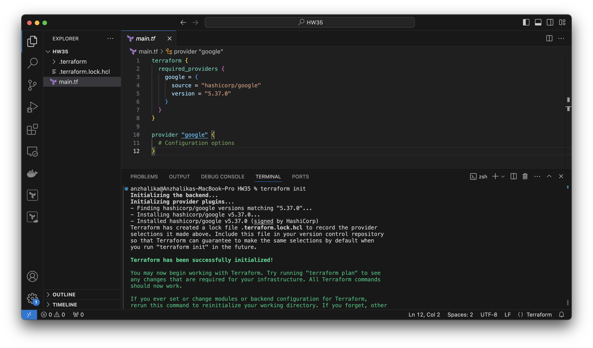
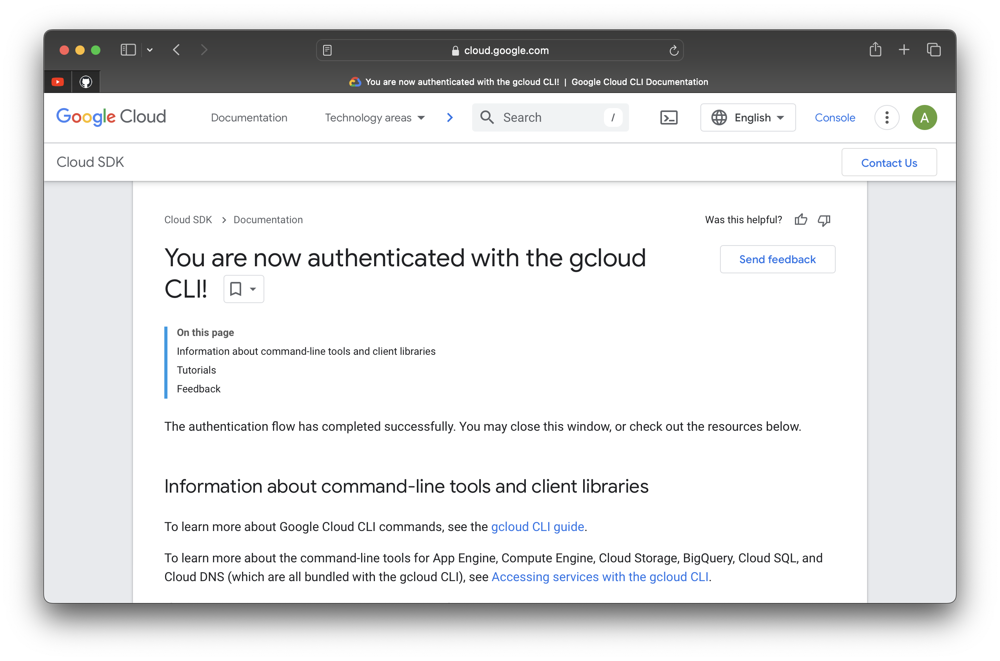
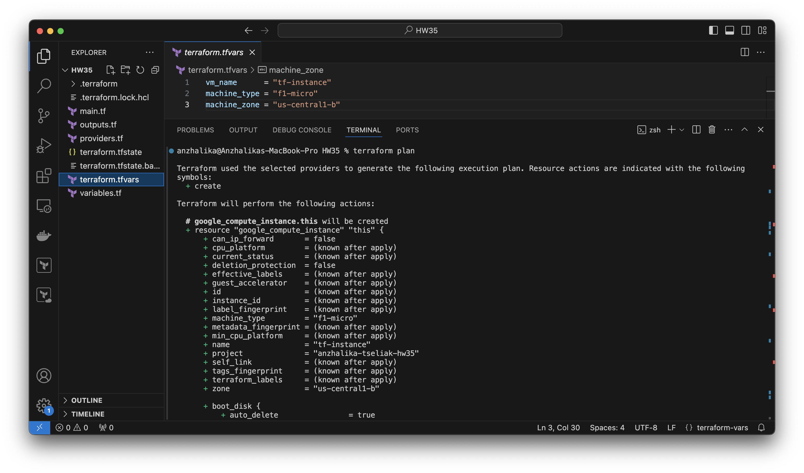
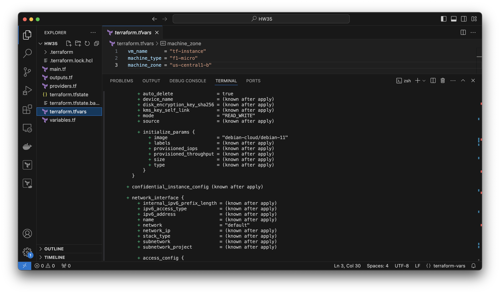
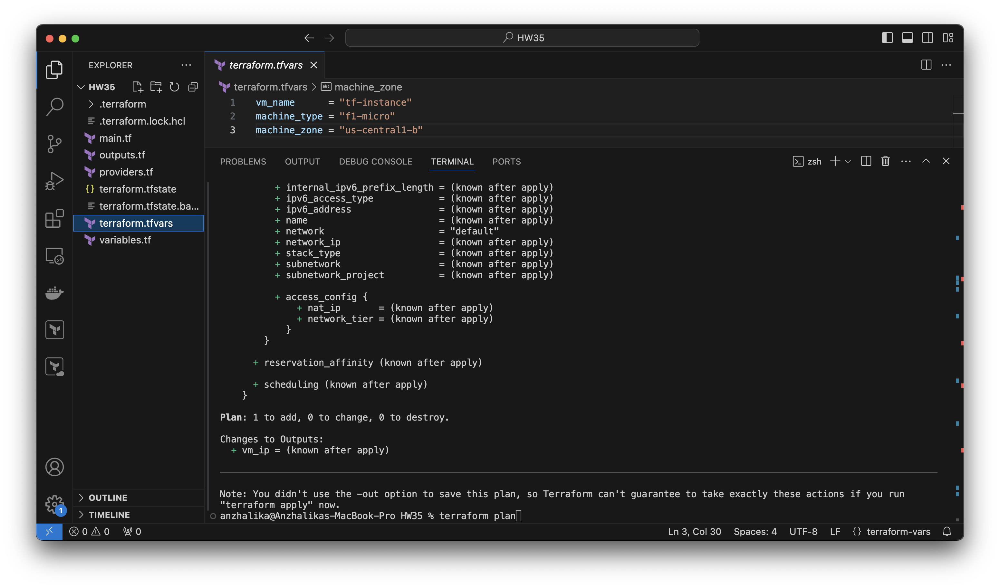
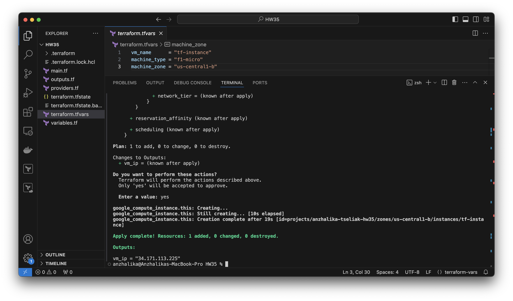
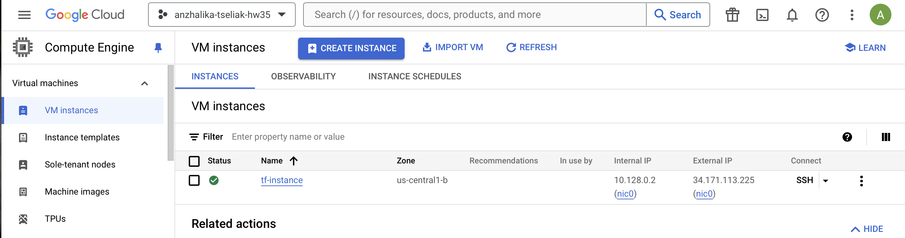
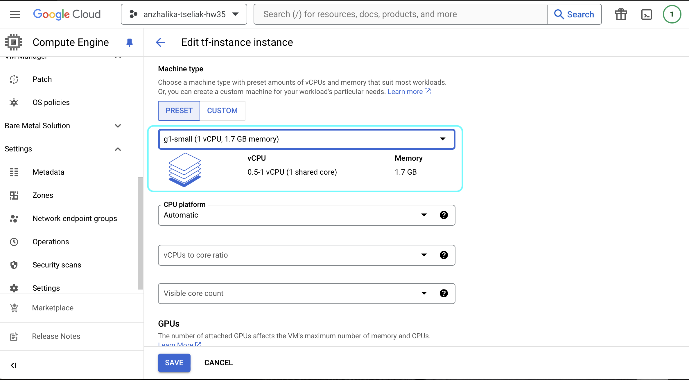
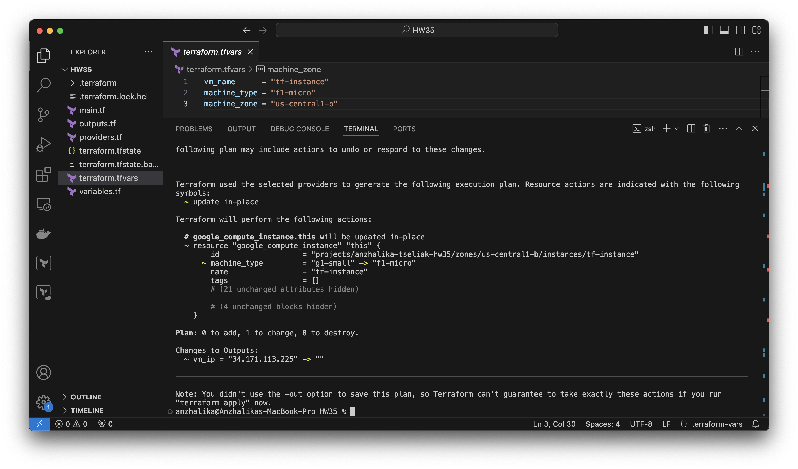

Установить Terraform.
-

```bash
brew tap hashicorp/tap

brew install hashicorp/tap/terraform

terraform --version
```


Написать шаблон для создания виртуальной машины в облаке. 
-
Инициализация согласно [инструкции](https://registry.terraform.io/providers/hashicorp/google/latest/docs/guides/getting_started) :

- Создать директорию

- Создать в созданной директории файл main.tf с содержимым:

```bash
terraform {
  required_providers {
    google = {
      source = "hashicorp/google"
      version = "5.37.0"
    }
  }
}

provider "google" {
  # Configuration options
}

```
- Инициализация

```bash
terraform init
```


### Аутентификация

>Упрощенный вариант - использование gcloud, но если он не установлен,необходимо использовать Service Accounts

```bash
gcloud auth application-default login
```


### Файлы задания:

Разделила на разные файлы, по примерам структуры terraform проектов, для того, чтобы отделить объявление переменных, их значений, конфигурации провайдера от кода, который создаёт виртуальную машину.

[main.tf](./main.tf) 

> Основной файл с кодом для создания виртуальной машины

[providers.tf](./providers.tf) 

> Сюда можно вынести провайдеры и их конфигурацию

[variables.tf](./variables.tf) 

> Объявление переменных (использовала default значение для примера)

[terraform.tfvars](./terraform.tfvars) 

> Значения переменных

[outputs.tf](./outputs.tf) 

> Вывод данных (ip виртуальной машины в качестве примера)

Остальные файлы не добавляются в репозиторий, так как они представляют собой зависимости, которые скачиваются во время шага init, и файл tfstate, который нельзя добавлять, так как он содержит пароли, ключи и т.п. в открытом виде. 

Познакомиться с командами:
-
- terraform init 
- terraform fmt
- terraform validate
- terraform plan
- terraform apply
- terraform destroy

> terraform init - инициализация  рабочего каталога  
>
>terraform fmt - перезапись файлов конфигурации
>
>terraform validate - проверка правильности синтаксиса файла
>
>terraform plan -  генерирование файла изменений,показывает что 
изменится при запуске
>
>terraform apply -  применение конфигурации
>
>terraform destroy -  удаление созданной инфаструктуры

Создать виртуальную машину в облаке при помощи ранее созданного шаблона.
-
- Посмотреть план выполнения:

```bash
terraform plan
```




- Создание

```bash
terraform apply
```



Поменять тип виртуальной машины (увеличить количество ресурсов) через веб-консоль и выполнить terraform plan. Что предлагает сделать Terraform?
-
Изменение типа vm c "f1-micro" на "g1-small"




Terraform предлагает вернуть все к исходному состоянию:
