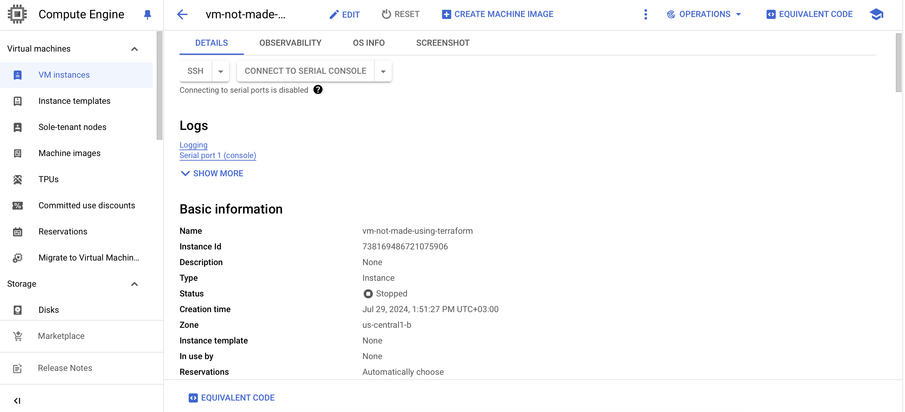
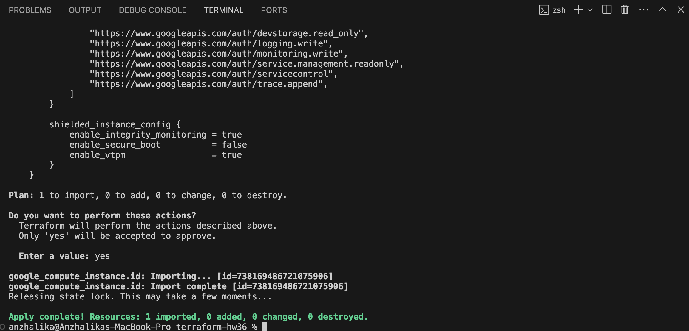
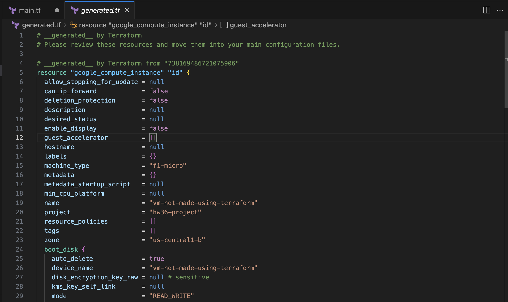

Сделать импорт ресурсов в Terraform для любой из домашек по облакам (HW29 - HW33). Например, импорт виртуальной машины, созданной вручную.
-


Созданная вручную vm:




Добавление import блока в main.tf 

``` bash
import {
  to = google_compute_instance.id
  id = var.vm-id
}
``` 
Переменная с id созданной vm:

``` bash
variable "vm-id" {
  type        = string
  default     = "738169486721075906"
}

``` 

Import:

``` bash
terraform plan -generate-config-out=generated.tf

terraform apply

``` 




generated.tf файл c vm:

